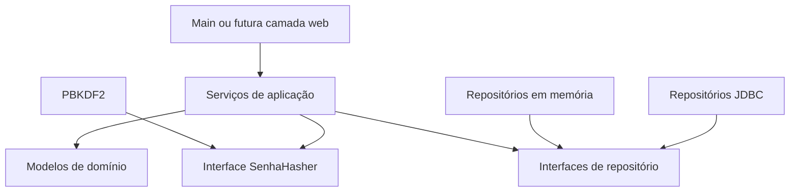

# Arquitetura

## Camadas

- `domain`: entidades, enumerações, contratos de repositório e contrato de proteção de senha.
- `application`: casos de uso, validações de fluxo e objetos de entrada e saída.
- `infrastructure`: implementações em memória, JDBC e PBKDF2.
- `app`: composição das dependências e ponto de entrada.
- `tests`: verificações executadas a partir do método `main()`.

## Fluxo de dependências

As dependências apontam para contratos do domínio. Dessa forma, uma futura API web poderá chamar os mesmos serviços sem carregar classes do Java Swing.
